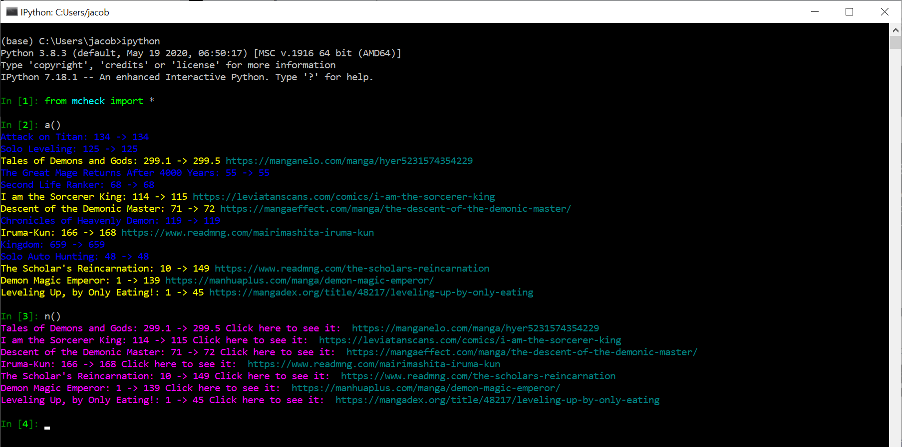

# MangaNewChapter

Stop clicking through endless links to see if there is a new chapter available. This Python script lets you <a href="README.md#function-directory">list all your favorite mangas</a> and then checks each one's latest chapter against your most recently read chapter. Currently <a href="README.md#Codes">supports web comics from</a> Mangelo, ReadMng, Zero and Leviatan Scans, Manga Effect, Mankakalot, MangaDex, LHTranslation, and Asura Scans.

When <a href="#su">setting up for yourself</a>, follow the linked steps for your OS. All Windows Users should go through Two-Step Install, regardless of having Python. Mac Users should go through the Two-Step Install if they do not have Python and One-Step Install if they do.

Windows Users who use the Two-Step Powershell Install can run in one click! Mac Users who go through the Four-Step Install and then navigate to the MangaNewChapter-main folder within terminal with <em>cd Downloads/MangaNewChapter-main</em>. Then they can run python3 checker.py. Two-Step Install for Mac needs further testing, but is available <a href="2m">here.</a> After using Two-Step or One-Step Install, users can open Terminal and run <em>sh launch.sh</em> to start the program. If this does not work, try <em>sh $HOME/launch.sh</em> .

<a href="https://youtu.be/AyZsZzuTAPg/" target="_blank">For Demo Video Ctrl+Click Here</a>

<h1 id="su">Two Step Windows Set Up</h1>
<ul>
  <li>If at any time during install it seems as if the program has gotten stuck, try clicking on the window and pressing enter once. Sometimes, working on other tasks or clicking out of the tab will pause the process.</li>
  <li>It is highly recommended to use Ctrl+Click to open each of these in a new tab and then copy their contents into Windows Powershell program on your computer.</li>
  <li>Find Windows Powershell by clicking the Windows button on your computer and typing Powershell.</li>
  <li>To paste text into Powershell, use your right click.</li>
  <li>During the second step, several Python windows will open and then close one-by-one. Please do not be alarmed by this as it is a normal part of set up.</li>
</ul>
<ol>
  <li><a href="WindowsSetUp\setup.ps1">Download the ZIP file and Miniconda</a> &nbsp;&nbsp;&nbsp;&nbsp;&nbsp;&nbsp;&nbsp;&nbsp;&nbsp;&nbsp;&nbsp;&nbsp;&nbsp;&nbsp;&nbsp;&nbsp;&nbsp;&nbsp;&nbsp;&nbsp;&nbsp;&nbsp;&nbsp;&nbsp;<a href="https://jacobk233811.github.io/MangaNewChapter/#windows-two-step"><em><b>Simple to Use Copy & Paste Page</em></b></a></li>
  <li><a href="WindowsSetUp\setup2.ps1">Install required packages and run the file</a></li>
</ol>

<a href="WindowsSetUp\launch.ps1">Copying and pasting this</a> or finding the launch.ps1 file within <em>C:\MQuicker\WindowsSetUp</em> and running it in Powershell will open MQuicker. Also, a shortcut to this program called "MQuicker - For Desktop" should appear on your Desktop (specifically <em>C:\Users\YOURNAME\Desktop</em>).
<a href="https://www.top-password.com/blog/set-ps1-script-to-open-with-powershell-by-default/">Setting PowerShell as the default program to open .ps1</a> by right clicking the icon, selecting Open With -> Choose Another App -> Always Use this App to Open .ps1 Files -> More Apps -> Look for an App on Your PC and then find and choose powershell.exe (the .exe usually is not shown) to easily access MQuicker from the Desktop. Following this, opening the shortcut will run the program.
(I found Powershell in C:\Windows\System32\WindowsPowerShell\v1.0) Alternatively, right click the shortcut and select "Run with Powershell"

<h1>Four Step Set Up on Mac</h1>
<ul>
  <li>If at any time during install it seems as if the program has gotten stuck, try clicking on the window and pressing enter once. Sometimes, working on other tasks or clicking out of the tab will pause the process.</li>
  <li>Find Terminal by going to Spotlight Search (magnifying glass in the top right of the screen) on your computer and typing Terminal.</li>
</ul>
<ol>
  <li>Download this GitHub Repository by <a href="https://github.com/JacobK233811/MangaNewChapter/archive/MQuicker-minimal.zip">Clicking the Green "Code" Button followed by Download ZIP</a>. Double clicking on the zip file should create a new folder. Note the folder location (it is usually Downloads/MangaNewChapter-main). </li>
  <li><a href="https://repo.anaconda.com/miniconda/Miniconda3-latest-MacOSX-x86_64.pkg">Get the 3.8 64-bit Version of Python from the pkg installer.</a> for Mac</li>
  <li>Open Terminal Program and Navigate to the Folder called MangaNewChapter-main by Using <em>cd Downloads/MangaNewChapter-main</em> until arrival. Then run <em>pip3 install -r requirements.txt</em> This may ask you to download software development tools, which you should do if prompted. Only do this in set up.</li>
  <li>Run <em>python3 checker.py</em>. This process will be how you normally access the program, preceded by naviagting to the MangaNewChapter-main folder.</li>
</ol>

<h1 id="2m">Two Step Set Up on Mac (Experimental)</h1>
<ul>
  <li>If at any time during install it seems as if the program has gotten stuck, try clicking on the window and pressing enter once. Sometimes, working on other tasks or clicking out of the tab will pause the process.</li>
  <li>It is highly recommended to use Cmnd+Click to open each of these in a new tab and then copy their contents into Terminal program on your computer.</li>
  <li>Find Terminal by going to Spotlight Search (magnifying glass in the top right of the screen) on your computer and typing Terminal.</li>
  <li>To paste text into Terminal, use Cmnd+V. You may not see all of the lines if you scroll up, but that is simply Terminal limiting your scrolling. They are there.</li>
  <li>During the second step, several Python windows will open and then close one-by-one. Please do not be alarmed by this as it is a normal part of set up.</li>
  <li>The program looks best in dark mode and if you are not a regular Terminal user, it makes sense to associate opening Terminal with starting MQuicker. You can do both by clicking Preferences in the top left of your screen or simply pressing Cmnd+, within Terminal. <a href="https://www.maketecheasier.com/customize-mac-terminal/">This guide explains the process.</a> I recommend following the steps in the first section, "Tweaking Terminal's Theme," and choosing Pro before running the second step. The second section, "Login Commands," should run the command <em>sh launch.sh</em> if you intend to use this feature. Only set this after installation is completed.</li>
</ul>
<ol>
  <li><a href="MacSetUp\setup.sh">Download the ZIP file and Miniconda</a> &nbsp;&nbsp;&nbsp;&nbsp;&nbsp;&nbsp;&nbsp;&nbsp;&nbsp;&nbsp;&nbsp;&nbsp;&nbsp;&nbsp;&nbsp;&nbsp;&nbsp;&nbsp;&nbsp;&nbsp;&nbsp;&nbsp;&nbsp;&nbsp;<a href="https://jacobk233811.github.io/MangaNewChapter/#mac-two-step"><em><b>Simple to Use Copy & Paste Page</em></b></a></li>
  <li><a href="MacSetUp\setup2.sh">Install required packages and run the file</a></li>
</ol>
<a href="MacSetUp\launch.sh">Copying and pasting this</a> or running <em>sh launch.sh</em> in your Terminal will start the program.
<h1 id="2m">One-Step Set Up on Mac (Only for Those Who Have Python [test by entering pip3 in Terminal])</h1>
<ul>
  <li>It is highly recommended to use Cmnd+Click to open each of these in a new tab and their copy their contents into Terminal program on your computer.</li>
  <li>Find Terminal by going to Spotlight Search (magnifying glass in the top right of the screen) on your computer and typing Terminal.</li>
  <li>To paste text into Terminal, use Cmnd+V. You may not see all of the lines if you scroll up, but that is simply Terminal limiting your scrolling. They are there.</li>
  <li>During this step, several Python windows will open and then close one-by-one. Please do not be alarmed by this as it is a normal part of set up.</li>
</ul>
<ol>
  <li><a href="MacSetUp\setup.sh">Download the ZIP file, Create a Virtual Environment, and Run the File</a> &nbsp;&nbsp;&nbsp;&nbsp;&nbsp;&nbsp;&nbsp;&nbsp;&nbsp;&nbsp;&nbsp;&nbsp;&nbsp;&nbsp;&nbsp;&nbsp;<a href="https://jacobk233811.github.io/MangaNewChapter/#mos"><em><b>Simple to Use Copy & Paste Page</em></b></a></li>
</ol>
<a href="MacSetUp\launch.sh">Copying and pasting this</a> or running <em>sh launch.sh</em> in your Terminal will start the program.

# Codes

### Status - The main difference between the three lies with automatic aligning of your latest chapter read with the latest released for utd. The other two depend upon Change Current.
<ul>
  <li>utd = up to date</li>
  <li>wip = work in progess</li>
  <li>yts = yet to start</li>
</ul>

### Source - There is a select list of supported manga sites that is continuously growing. Names are case-sensitive.
<ul>
  <li>attackontitanmanga.com -> AoT</li>
  <li>mangelo.com -> Mangelo</li>
  <li>zeroscans.com & leviatanscans.com -> ZeroLeviatan</li>
  <li>mangaeffect.com -> Effect</li>
  <li>readmng.com -> ReadMng</li>
  <li>mangadex.org -> MangaDex</li>
  <li>mangkakalot.com -> Kakalot</li>
  <li>pmscans.com & manhuaplus.com -> WP</li>
  <li>lhtranslation.net -> lh</li>
  <li>asurascans.com -> asura</li>
 </ul>
 
<h3>Tier - My personal rankings of the "starter pack" manga as seen in <a href="tier.txt">tier.txt</a>. Intended to help selective new readers choose only the best. Found as (#) in manga names.</h3>
<ol>
  <li>The Top Tier reserved for my favorites.</li>
  <li>The Middle Tier for all the manga I really liked.</li>
  <li>The Bottom Tier holds manga that I liked some parts and not others. </li>
 </ol>
 Note: I read and enjoyed all manga within the initial list.txt file so don't take this to mean Tier 2 or 3 are low quality.
 
<h3> Categories - My personal categories for the "starter pack" manga as seen in <a href="categories.txt">categories.txt</a>. Intended to help readers identify preferences. Found as \[Abcd\] in manga names.</h3>
<ol>
  <li>System Leveling - Worlds where there exists a system of some sort that allows "players" or "hunters" to level up and become physically stronger.</li>
  <li>Culivator Reincarnation - The main character reincarnated and uses his knowledge to cultivate faster. More fantastical/magical than below.</li>
  <li>Martial Reincarnation - The main character reincarnated and uses his knowledge to train faster. More realistic than above.</li>
  <li>Plot Heavy - Stories where the action takes a backseat to adventure and character development.</li>
  <li>Underdog Cultivator - Someone, typically the weakest character, miraculously acquires an artifact or method to rise up and become the strongest.</li>
  <li>Virtual Reality Game - Worlds where there exists a very popular VR game that the main character enters and becomes famous within.</li>
 </ol>
 Note: Order of categories does not mark my preferences.
 
# Function Directory
<ol>
  <li>a() - Shows all manga on your list with the latest chapter released.</li>
  <li>n() - Shows all manga on your list where you have not read the latest chapter released.</li>
  <li>s() - Saves all manga on your list with the latest chapter released to a text file named MM/DD/YY.txt within the saved folder.</li>
  <li>change_current() - Iterates through every manga on your list and lets you change the latest chapter read and status. Easily skip through with the Enter key.</li>
  <li>add() - Add a manga to your list by providing the Name (no requirements), Link (include the https://), Source Code (see Source in Codes above), Current Chapter, and Status Code.</li>
  <li>primer() - Adjusts the initial list.txt file containing which mangas you'd like to track and latest.txt file containing what chapter you are on (both found within the saved folder).</li>
  <li>rate() - Lets you rate all the manga on your list on a variety of criteria including but not limited to Overall, Action, and Happy.</li>
</ol>

